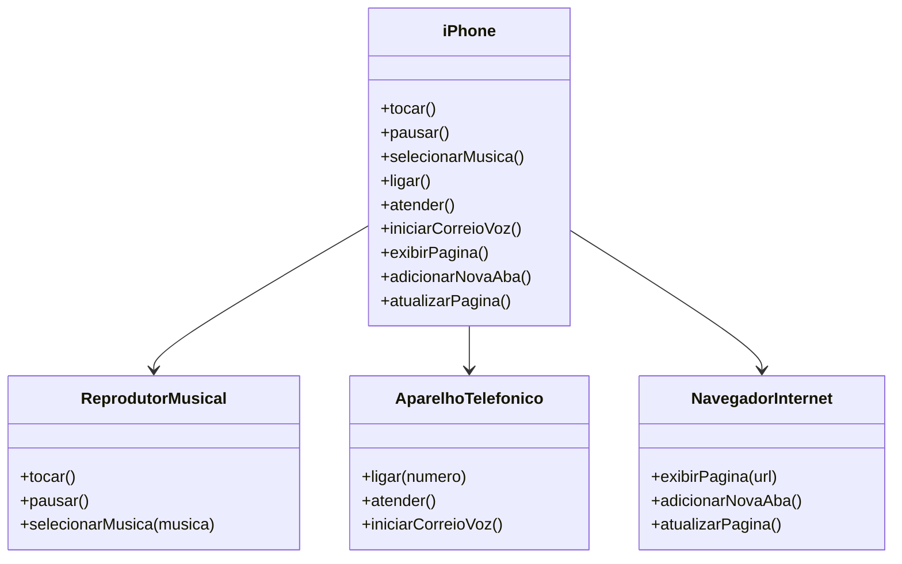

# 📱 Desafio: Modelagem e Implementação do iPhone

Este repositório contém a resolução do desafio proposto de **POO** na **Trilha Java Básico**  da [Digital Innovation One (DIO)](https://github.com/digitalinnovationone/trilha-java-basico/blob/main/desafios/poo/README.md). O objetivo do desafio é modelar e implementar um **componente iPhone** utilizando conceitos de **Programação Orientada a Objetos (POO)** em Java, incluindo **interfaces** e **classes**.

## 🚀 Descrição do Desafio

O desafio propõe a modelagem e diagramação UML do iPhone, abrangendo suas funcionalidades principais:

- **Reprodutor Musical** 🎵
  - `tocar()`
  - `pausar()`
  - `selecionarMusica(String musica)`

- **Aparelho Telefônico** 📞
  - `ligar(String numero)`
  - `atender()`
  - `iniciarCorreioVoz()`

- **Navegador na Internet** 🌍
  - `exibirPagina(String url)`
  - `adicionarNovaAba()`
  - `atualizarPagina()`

📌 **Referência**: O desafio se baseia no vídeo de lançamento do primeiro iPhone (Apple Keynote - 2007).

🎥 Link: [YouTube](https://www.youtube.com/watch?v=9ou608QQRq8) (Minutos relevantes: **00:15 - 00:55**)

---

## 🛠️ Solução Implementada

Para estruturar o projeto, foram utilizadas **interfaces** para definir as funcionalidades, e uma **classe concreta** `iPhone` que implementa todas elas.

### 🔹 Estrutura UML
O diagrama UML abaixo representa a modelagem do sistema:

### 🔹 Código Implementado
Abaixo está o código principal da classe `iPhone` :

[Código](https://github.com/romildo-feliciano/dio-trilha-java-basico/blob/main/desafio-poo/src/iPhone.java)

### 🔹 **Por que utilizar interfaces?**
Optei por utilizar **interfaces** para representar as funcionalidades do iPhone, pois:

✅ Promovem um design modular e reutilizável;

✅ Seguem o princípio da **Segregação de Interfaces (ISP)** do SOLID;

✅ Permitem que outros dispositivos futuramente implementem apenas partes do comportamento, sem herdar métodos desnecessários.

---

## 📜 Conclusão
Este projeto permitiu praticar **modelagem UML**, **POO em Java** e **implementação de interfaces**.

📌 **Desafio concluído com sucesso! 🚀**
